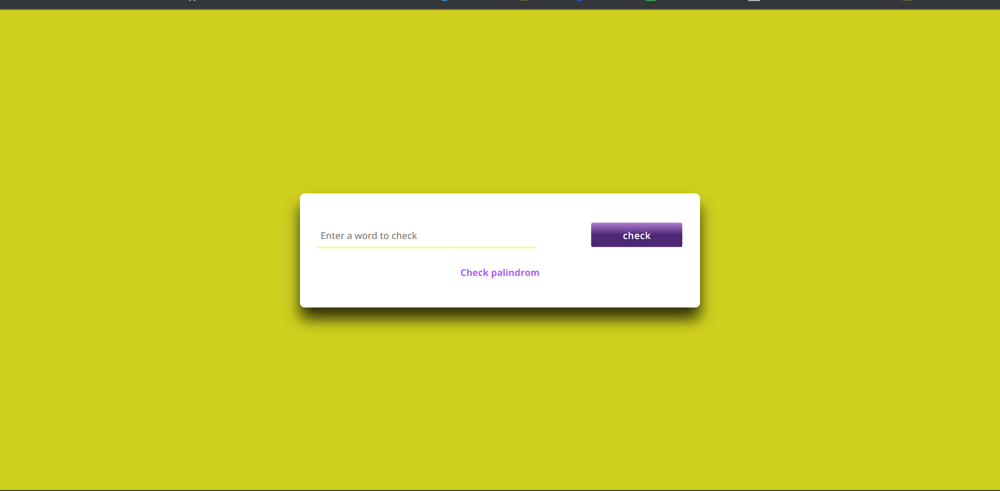

# javascript-palindrome-fsjs
**By Prajwal**

## [GO LIVE](https://palindrom-javascript-fsjs.netlify.app/)

## 

---

## Technologies used

> JavaScript

> HTML

> CSS
---

## **Skill Gained in the project**
1. css revision with some new concept.
2. for loop.
3. Array indexing in javascript.
4. Math.floor() in javascript.
5. validating the string in regular expression.
6. repalce() method in string.
7. Really worth project boost lots of knowledge of javascript.
   
## **Time taken to finish this**
  -it requires me 4 hours to write the javascript logic and 30 min to desighn the app.